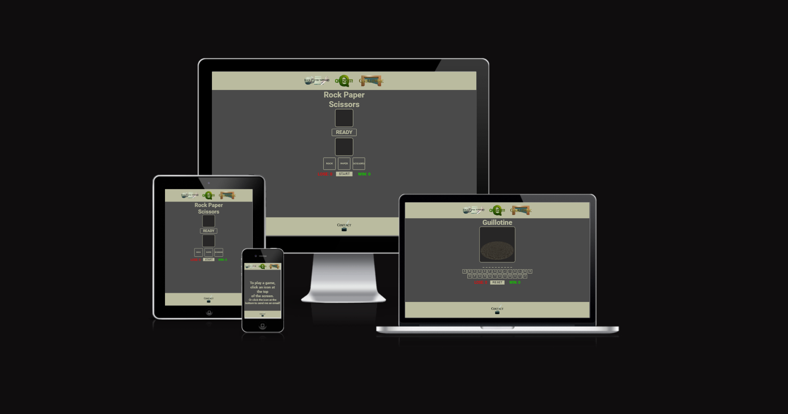

# Play A Game 

**Developer: Gustaaf Milzink**

[Live website](https://g-milzink.github.io/CI_PP2_GS/)

## Table of Content
  - [Project Goals](#project-goals)
    - [User Goals](#user-goals)
    - [Site Owner Goals](#site-owner-goals)
  - [User Experience](#user-experience)
    - [Target Audience](#target-audience)
    - [User Requirements and Expectations](#user-requirements-and-expectations)
  - [User Stories](#user-stories)
    - [Site User](#site-user)
    - [Site Owner](#site-owner)
  - [Design](#design)
    - [Colour Scheme](#colour-scheme)
    - [Fonts](#fonts)
    - [Structure](#structure)
    - [Wireframes](#wireframes)
  - [Technologies Used](#technologies-used)
    - [Languages](#languages)
    - [Frameworks, Libraries & Tools](#frameworks-libraries--tools)
  - [Features](#features)
  - [Validation](#validation)
    - [HTML Validation](#html-validation)
    - [CSS Validation](#css-validation)
    - [JavaScript Validation](#javascript-validation)
    - [Accessibility](#accessibility)
    - [Performance](#performance)
  - [Testing](#testing)
    - [Performing tests on various devices](#performing-tests-on-various-devices)
    - [Browser compatibility](#browser-compatibility)
    - [Testing user stories](#testing-user-stories)
  - [Bugs](#bugs)
  - [Deployment](#deployment)
  - [Credits](#credits)
  - [Acknowledgements](#acknowledgements)

## Project Goals

The goal of this project was to create a website where the user can play a few simple games to pas time.

### Site Owner Goals

- Provide fully responsive and accessible website.
- Provide several easily understood games to choose from.
- Apply visually appealing design.
- Provide an intuitive way to navigate the website.

## User Experience

### Target Audience

- Anyone who wants to have fun playing a game with easily understood mechanics.

### User Requirements and Expectations

- Intuitive navigation.
- Easily understood game mechanics.
- Clean presentation that aides users understanding of game mechanics.
- Links that work as expected.
- Website needs to function on any device.
- A way to contact the developer to give feedback.

### Site User

1. I want to choose between several games.
2. I want to easily understand the rules of the different games.
3. I want clear feedback when I win or lose a game.
4. I want to be able to play the games on any device.
5. I want to be able to get in touch with the developer.
6. I want confirmation that I filled out the contact form correctly.

### Site Owner

7. I want the user to choose between Rock Paper Scissors, A quiz and a Hangman game.
8. I want user to easily understand the different games.
9. I want my game to be fully responsive
10. I want the user to not have to use the back button when they receive a 404 error.
11. I want user to be able to send me a message and provide feedback.

## Design

### Colour Scheme

The colour scheme consists of mostly neutral colours the Dark grey background providing clear contrast for the lighter text colour.
- Yellow and white are used to show when an element has been clicked.
- Red and green are used to provide clear recognizable feedback to the user about the different win/lose states of the games.
- Minor variations of the basic gray tints are used to provide feedback on the keyboard for the Guillotine game.

### Font

The 'Roboto' font is used to display all the main content across the site. It was chosen for readabillity and aesthetics. A simple straightforward font that works well with the colour scheme.

### Structure

The websites main structure has been kept simple and clear without any unnecesary elements to avoid clutter and improve accesibillity.

- The site consist of the following screens:
  - Welcome screen pointing users to the game selection and the option to send a message
  - A page containing the 'Rock Paper Scissors' game.
  - A page containing the 'Quizit' game.
  - A Page containg the 'Guillotine' (hangman) game.
  - A page containing a contact form.
  - A custom 404 page.

### Wireframes