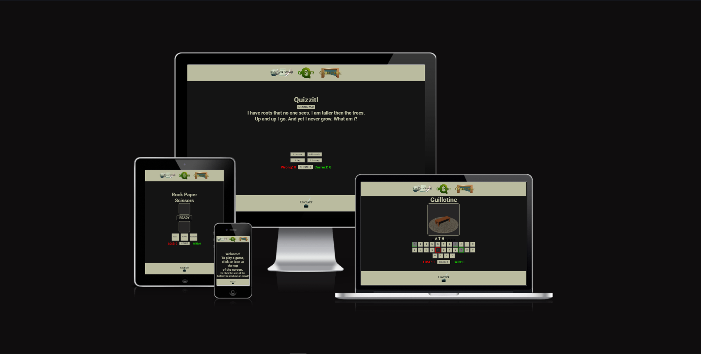
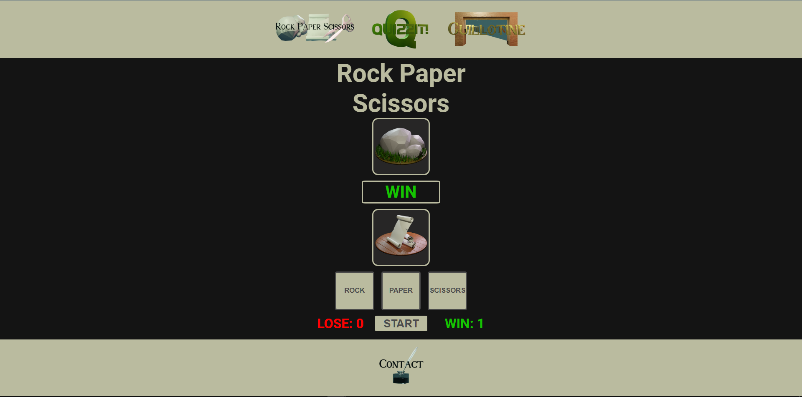
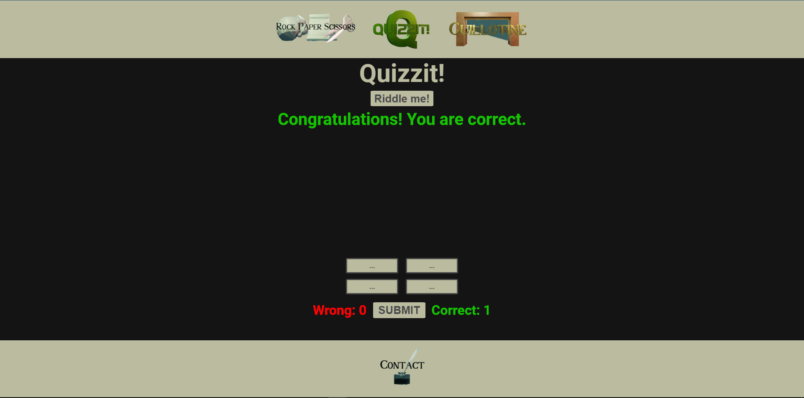
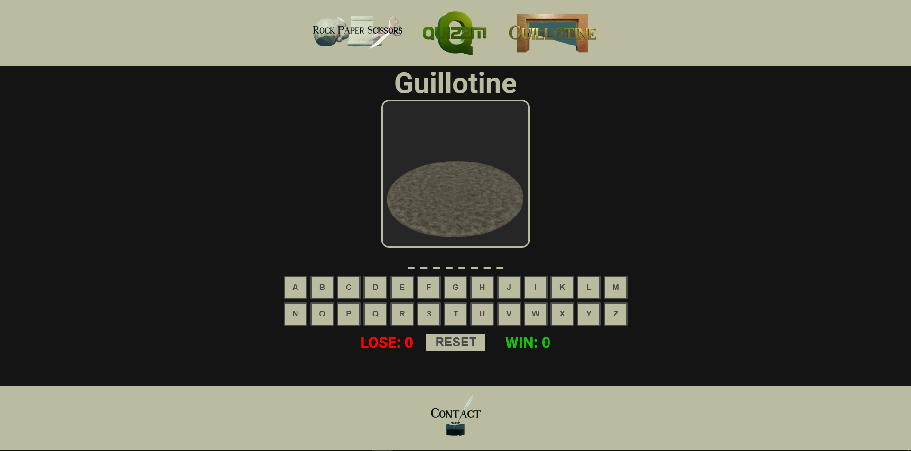
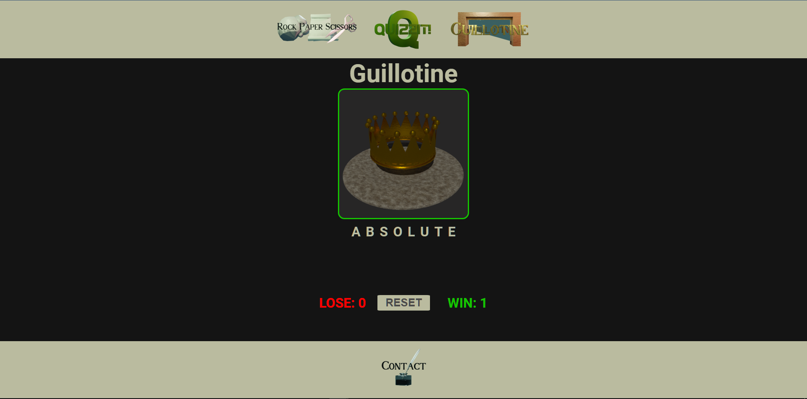
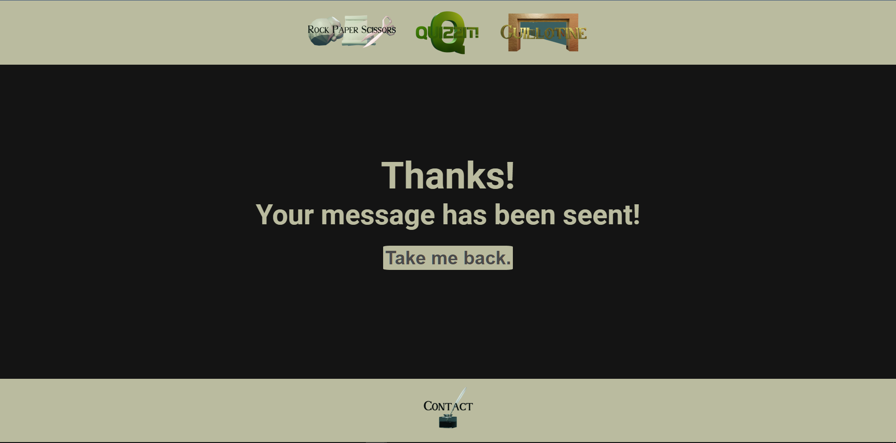
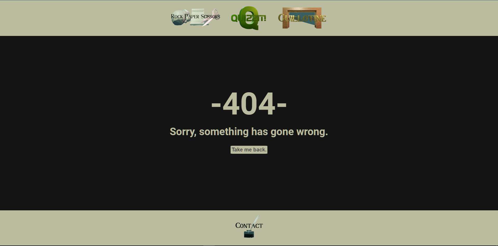
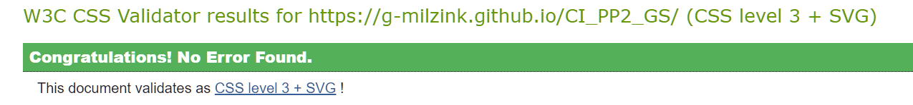
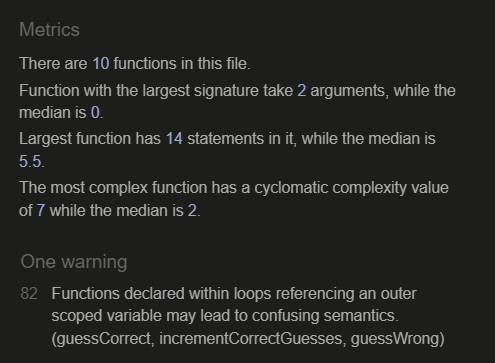
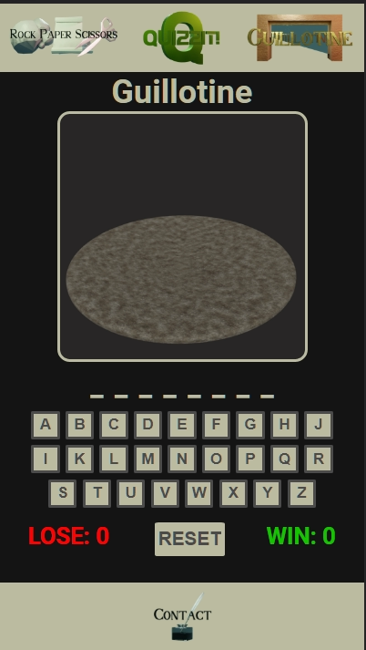

# Play A Game 

**Developer: Gustaaf Milzink**

[Live website](https://g-milzink.github.io/CI_PP2_GS/)

## Table of Content
  - [Project Goals](#project-goals)
    - [User Goals](#user-goals)
    - [Site Owner Goals](#site-owner-goals)
  - [User Experience](#user-experience)
    - [Target Audience](#target-audience)
    - [User Requirements and Expectations](#user-requirements-and-expectations)
  - [User Stories](#user-stories)
    - [Site User](#site-user)
    - [Site Owner](#site-owner)
  - [Design](#design)
    - [Colour Scheme](#colour-scheme)
    - [Fonts](#fonts)
    - [Structure](#structure)
    - [Wireframes](#wireframes)
  - [Technologies Used](#technologies-used)
    - [Languages](#languages)
    - [Frameworks, Libraries & Tools](#frameworks-libraries--tools)
  - [Features](#features)
  - [Validation](#validation)
    - [HTML Validation](#html-validation)
    - [CSS Validation](#css-validation)
    - [JavaScript Validation](#javascript-validation)
    - [Accessibility](#accessibility)
    - [Performance](#performance)
  - [Testing](#testing)
    - [Performing tests on various devices](#performing-tests-on-various-devices)
    - [Browser compatibility](#browser-compatibility)
    - [Testing user stories](#testing-user-stories)
  - [Bugs](#bugs)
  - [Deployment](#deployment)
  - [Credits](#credits)
  - [Acknowledgements](#acknowledgements)

## Project Goals

The goal of this project was to create a website where the user can play a few simple games to pass time.

### Site Owner Goals

- Provide fully responsive and accessible website.
- Provide several easily understood games to choose from.
- Apply visually appealing design.
- Provide an intuitive way to navigate the website.

## User Experience

### Target Audience

- Anyone who wants to have fun playing a game with easily understood mechanics.

### User Requirements and Expectations

- Intuitive navigation.
- Easily understood game mechanics.
- Clean presentation that aides users understanding of game mechanics.
- Links that work as expected.
- Website needs to function on any device.
- A way to contact the developer to give feedback.

## User Stories

### Site User

1. I want to choose between several games.
2. I want to easily understand the rules of the different games.
3. I want clear feedback when I win or lose a game.
4. I want to be able to play the games on any device.
5. I want to be able to get in touch with the developer.
6. I want confirmation that I filled out the contact form correctly.

### Site Owner

7. I want the user to be able to choose between Rock Paper Scissors, A quiz and a Hangman game.
8. I want user to easily understand the different games.
9. I want my game to provide clear feedback to the user.
10. I want the user to not have to use the back button when they receive a 404 error.
11. I want user to be able to send me a message and provide feedback.

## Design

### Colour Scheme

The colour scheme consists of mostly neutral colours the Dark grey background providing clear contrast for the lighter text colour.
- Yellow and white are used to show when an element has been clicked.
- Red and green are used to provide clear recognizable feedback to the user about the different win/lose states of the games.
- Minor variations of the basic gray tints are used to provide feedback on the keyboard for the Guillotine game.

### Font

The 'Roboto' font is used to display all the main content across the site. It was chosen for readabillity and aesthetics. A simple straightforward font that works well with the colour scheme.

### Structure

The websites main structure has been kept simple and clear without any unnecesary elements to avoid clutter and improve accessibillity.

- The site consist of the following five pages:
  - Welcome screen pointing users to the game selection in the header and the contact link in the footer.
  - A page containing the 'Rock Paper Scissors' game.
  - A page containing the 'Quizit' game.
  - A Page containg the 'Guillotine' (hangman) game.
  - A page containing a contact form.
  - A custom 404 page.

### Wireframes

Index

Rock Paper Scissors

Quizzit

Guillotine

Contact

404

## Technologies Used

### Languages

- HTML
- CSS
- JavaScript

### Tools & Libraries

- [Blender](https://www.blender.org/) Was used to create logo's and game images.
- [Gimp](https://www.gimp.org/) Was used to crop/resize/convert images.
- [Krita](https://krita.org/) Was used to highlight cerain sections of images.
- [Swatcher](https://swatcherapp.com/) Was used to construct the colour scheme.
- [EmailJS](https://www.emailjs.com) Was used to send email from the contact form.
- [Favicon.io](https://favicon.io) Was used for making creating the websites favicons.
- [Google Fonts](https://fonts.google.com/) Was used to implement the 'roboto' font.
- [Chrome dev tools](https://developers.google.com/web/tools/chrome-devtools) Where used for debugging and testing performance.
- [WC3 Validator](https://validator.w3.org/), [Jigsaw W3 Validator](https://jigsaw.w3.org/css-validator/), [JShint](https://jshint.com/) 
where used to validate HTML, CSS and Javascript code respectively.
- [Wave Validator](https://wave.webaim.org/) was used to confirm accesabillity.

## Features

The website consists of five pages containing 9 seperate features.

### Header
- featured on all pages.
- contains links to the available games.
- user stories covered: 1, 7

Header image

### Footer
- featured on all pages.
- contains links to the contact page.
- user stories covered: 5, 11

Footer image

### Home (welcome screen)
- shown when user first loads the website.
- displays a welcome message and points user to the links in the header and footer.
- user stories covered: 1, 7, 11

Home image

### Rock Paper Scissors (game)
- loads when the user clicks the appropriate icon in the header.
- Displays an intuitively laid out interface for playing a "rock paper scissors" game.
- Interactive elements have darker text against a light background to stand out. (This is consisitent throughout all three games.)
- once the user clicks 'start' a countdown is displayed
- once the countdown hits 'Go!' the user can then choose: Rock, Paper or Scissors. The site will then simulate the opponents choice en the outcome will be evaluated.
- Score section at the bottom of the screen keeps track of wins/losses.
- user stories covered: 2, 3, 8, 9

Rock Paper Scissors, pre-game

Rock Paper Scissors, win

Rock Paper Scissors, draw

Rock Paper Scissors, lose

### Quizzit (game)
- loads when the user clicks the appropriate icon in the header.
- Displays an intuitively laid out interface for playing a simple quiz.
- Interactive elements have darker text against a light background to stand out. (This is consisitent throughout all three games.)
-Once the user clicks the "riddle me" button the site presents a simple riddle and populates the buttons at the bottom possible answers. 
- The button that displays the correct answer is different everytime a particular riddle is displayed.
- The incorrect answers options are different every time a particular riddle is displayed.
- Once the user has selected an answer they can 
- user stories covered: 2, 3, 8, 9

Quizzit, pre-game

Quizzit, riddle shown

Quizzit, guess correct

Quizzit, guess incorrect

### Guillotine (game)
- loads when the user clicks the appropriate icon in the header.
- Displays an intuitively laid out interface for playing a simple hangman type game.
- Interactive elements have darker text against a light background to stand out. (This is consisitent throughout all three games.)
- As soon as the page loads the user is presented with a game in progress. 
- The user can select letters from the virtual keyboard to try and guess the word.
- The keyboard visually represents wich letters have been guessed 
and wether they where right or wrong. Green borders for correct guesses and red for incorrect ones.
- Every correct guess fills in the appropriate letters in the space below the main image until the entire word is guessed and the game is won.
- Every incorrect guess progresses a sequence of images displayed in the center of the screen until the guillotine drops and the game is lost.
- Once the round is lost or won the keyboard will dissapear so no new letters can be chosen until the game is reset.
- The 'reset' button clears the game and generates a new word. 
- user stories covered: 2, 3, 8, 9

Guillotine start

Guillotine mid-game

Guillotine win

Guillotine lose

### Contact 
- Loads when the user clicks the contact icon in the footer.
- Displays a simple form with wich the user can send and email to the developer by entering their name, email adress and a  short message.
- The form will submit only when all three fields have been filled out.
- Once the user submitss their message the submit button will change it text content to 'working' to inform the user that their request is being processed.
- Once the message has been sent the user is presented with confirmation.
- user stories covered: 5, 11

Contact (form)

Contact (working)

### Form confirmation
- Loads once the user has succesfully submitted a message.
- Shows a short message thanking the user for completing the form and presents a link back to Home page.
- user story covered: 6

Contact (confirmation)

### 404 
- Custom 404 page loads when the user tries to navigate to a non-existing url. 
- The user is presented with a short apology and a link back to the homepage.
- user story covered: 10

404 page

## Validation

### HTML Validation

The W3C Markup Validation Service was used to validate the HTML of the website. All pages pass without errors or warnings.

index.html

rps.html

quizzit.html

guillotine.html

contact.html

404.html

### CSS Validation

The W3C Jigsaw CSS Validation Service was used to validate the CSS of the website. All CSS passed without errors.

whole page

style.css

### Javascript

JSHint JavaScript Validation Service was used to validate the Javascript files. No issues of importance where found.

rps.js

quizzit.js

guillotine.js

contact.js

game-data.js

### Accessabillity
WAVE accessibility evaluation tool was used to ensure the website met high accessibility standards. All pages passed with 0 errors or alerts.

index.html

rps.html

quizzit.html

guillotine.html

contact.html

404.html

### Performance

### Performance 
Google Lighthouse in Google Chrome Developer Tools was used to test the performance of the website. 

index.html

rps.html

quizzit.html

guillotine.html

contact.html

404.html

## Testing

### Performing tests on various devices 
The website was tested on the following devices:
- Samsung A40 smartphone
- HP 14s-fq0050nd AMD Ryzen 3 3250U 14" laptop
- Generic Desktop PC

Testing with Google Chrome Develepor Tools Device Toggling reveals that the site remains functional and esthetically consistent across all devices.

### Browser compatability
The website was tested on the following browsers:
- Google Chrome
- Mozilla Firefox
- Microsoft Egde

### Testing user stories

1. I want to choose between several games.

| **Feature** | **Action** | **Expected Result** | **Actual Result** |
|-------------|------------|---------------------|-------------------|
|Homepage|Look for information on how to select a game|See welcome message|Works as expected| 
|Header|Click link to select a game|User is brought to appropriate page| Works as expected|

screenshot

 

2. I want to easily understand the rules of the different games.

| **Feature** | **Action** | **Expected Result** | **Actual Result** |
|-------------|------------|---------------------|-------------------|
|Clear colour scheme|Observe screen for possible interractions|Notice interactive elements distinct from background | Works as expected|

Screenshot

Screenshot

Screenshot

 

3. I want clear feedback when I win or lose a game.

| **Feature** | **Action** | **Expected Result** | **Actual Result** |
|-------------|------------|---------------------|-------------------|
|Visual feedback from game systems|Win/Lose game|Get clear feedback| Works as expected|
|Win/lose counters|Look for score counters|Find counters at bottom of screen|Works as expected|

Screenshot

Screenshot

Screenshot

Screenshot

Screenshot

Screenshot

 

4. I want to be able to play the games on any device.

| **Feature** | **Action** | **Expected Result** | **Actual Result** |
|-------------|------------|---------------------|-------------------|
|Responsive Design|Load website on mobile device|Content scales appropriately|works as expected|

Screenshot

Screenshot

Screenshot

Screenshot

Screenshot

 

5. I want to be able to get in touch with the developer.

| **Feature** | **Action** | **Expected Result** | **Actual Result** |
|-------------|------------|---------------------|-------------------|
|Footer|Click contact link|Navigate to contact page|Works as expected|
|contact page|Navigate to contact page|Find contact form|Works as expected|

Screenshot

Screenshot

 

6. I want confirmation that I filled out the contact form correctly.

| **Feature** | **Action** | **Expected Result** | **Actual Result** |
|-------------|------------|---------------------|-------------------|
|contact page|Fill out contact form|Receive confirmation|Works as expected|

Screenshot

 

7. I want the user to be able to choose between Rock Paper Scissors, A quiz and a Hangman game.

| **Feature** | **Action** | **Expected Result** | **Actual Result** |
|-------------|------------|---------------------|-------------------|
|Homepage|Look for information on how to select a game|See welcome message|Works as expected| 
|Header|Click link to select a game|User is brought to appropriate page| Works as expected|

screenshot

screenshot

screenshot

screenshot

 

8. I want the user to easily understand the different games.

| **Feature** | **Action** | **Expected Result** | **Actual Result** |
|-------------|------------|---------------------|-------------------|
|Clear colour scheme|Observe screen for possible interractions|Notice interactive elements distinct from background | Works as expected|

Screenshot

Screenshot

Screenshot

 

9. I want my game to be fully responsive and provide feedback

|Visual feedback from game systems|Win/Lose game|Get clear feedback| Works as expected|
|Win/lose counters|Look for score counters|Find counters at bottom of screen|Works as expected|

Screenshot

Screenshot

Screenshot

Screenshot

Screenshot

Screenshot

 

10. I want the user to not have to use the back button when they receive a 404 error.

| **Feature** | **Action** | **Expected Result** | **Actual Result** |
|-------------|------------|---------------------|-------------------|
|Custom 404 page| Navigate to non existent url|Display custom 404 page|Works as expected|

screenshot

 

11. I want user to be able to send me a message and provide feedback.

| **Feature** | **Action** | **Expected Result** | **Actual Result** |
|-------------|------------|---------------------|-------------------|
|Footer|Click contact link|Navigate to contact page|Works as expected|
|contact page|Navigate to contact page|Find contact form|Works as expected|

Screenshot

Screenshot

 

## Bugs
### Contact form
* Currently the form will allow submission if all fields are filled out and the value of the email field 
  <em>resembles</em> an email adres: [abcdef]@[abcdef]. This allows for incomplete/incorrect email adresses to be used.
* Possible solution: Implement actual validation to confirm the entered email adress.
### Contact form
* The textarea field will move off screen when in focus on smaller screen sizes.
* Possible solution: Adjes responsive design to keep textarea field in view on smaller screens.
### Rock Paper Scissors
* Clicking the "start" button more then once in quick succesion creates mutiple timers in the background wich causes incinsistent behaviour for the countdown display.
* Possible solution: Implement conditional statement to check if a timer already exists.
### guillotine
* After winning/Losing the game, clicking the keyboard will keep exposing letters even though the round has ended.
* Possible solution: Remove keyboard from view once round has been lost/won.

## Deployment
The website was deployed using GitHub Pages by following these steps:
1. Go to the GitHub repository and navigate to the Settings tab.
2. Scroll down and select Pages in the menu on the left.
3. For the source select Branch: main
4. The page will refresh after some time and a message wil be displayed: "Your site is published at https://g-milzink.github.io/CI_PP2_GS/

You can for fork the repository by following these steps:
1. Go to the GitHub repository
2. Click on Fork button in upper right hand corner

You can clone the repository by following these steps:
1. Go to the GitHub repository 
2. Locate the Code button above the list of files and click it 
3. Select if you prefere to clone using HTTPS, SSH, or Github CLI and click the copy button to copy the URL to your clipboard
4. Open Git Bash
5. Change the current working directory to the one where you want the cloned directory to be
6. Type git clone and paste the URL from the clipboard ($ git clone https://github.com/YOUR-USERNAME/YOUR-REPOSITORY)
7. Press Enter to create your local clone.

## Credits

### Images
- All logos and images created by G.Milzink

### Code
Code to send email from form using emaijs taken (and adapted) from tutorial:
 * "Contact Form with Email Js | Send Emails using JavaScript through Email Js | Email Js Tutorial"
 * by ALTERCODES
 * https://www.youtube.com/watch?v=5EZsRnJpUNU&t=1s&ab_channel=ALTERCODES

## Acknowledgements
I would like to take the opportunity to thank:
- My mentor Mo Shami for his feedback, advice, guidance and support.
- My partner Geertje van der Zalm for her support, inspiration and patience.
- My mother Anne Rijsdijk and her husband Mickel Pereira for helping me persue this dream.
- Anyone who spends time on the internet awnsering questions and helping others to learn.
